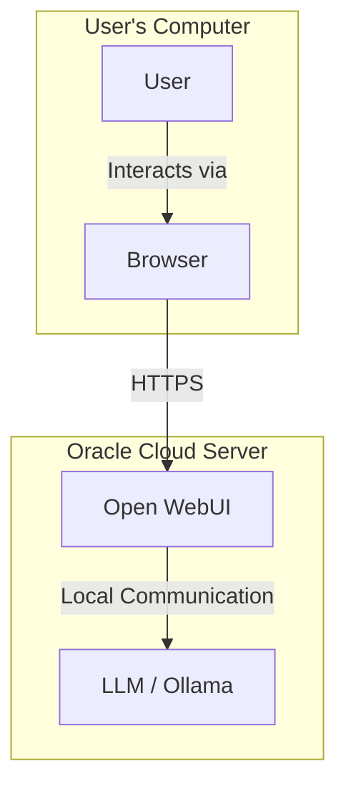
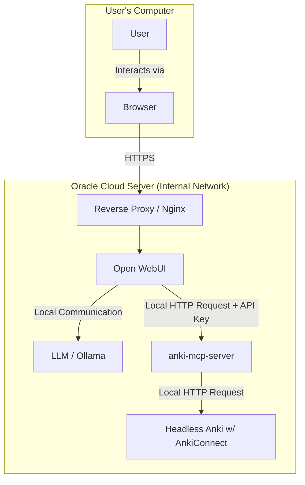

PROJECT SUMMARY MUST BE VERIFIED, DO NOT TRUST ITS CONTENTS AS CORRECT
---

### Project Summary: Integrating Anki with OpenWebUI

The goal is to enable OpenWebUI and its integrated LLMs to securely interact with your personal Anki collection, which will be running 24/7 on your Oracle Cloud server. This will allow the LLM to use your Anki decks as a tool for creating and retrieving flashcards.

### 1\. Current Setup

You are currently running Open WebUI and an LLM (e.g., Ollama) on a single Oracle Cloud server. You access the web interface securely over the internet.

### 2\. Desired Setup

The final architecture will co-locate two new services on your server: the **Headless Anki** container and the **`anki-mcp-server`**. All communication between components will happen on the server's internal network, and the `anki-mcp-server` will be protected by its own API key to ensure that only Open WebUI can command it. The reverse proxy remains the single, secure entry point from the internet.

### 3\. Required Tasks

Here is the checklist of tasks to achieve the desired setup:

1.  **Deploy Headless Anki Container**

      * Run the `headless-anki` Docker container on your Oracle Cloud server.
      * Mount your personal Anki profile directory to `/data` inside the container.
      * **Crucially, do not expose the AnkiConnect port (`8765`) to the public internet.** Publish it only to the local machine (e.g., `docker run -p 127.0.0.1:8765:8765 ...`).

2.  **Modify the `anki-mcp-server` Code**

      * **Convert to an HTTP Server:** In `src/ankiMcpServer.ts`, replace `StdioServerTransport` with `HttpServerTransport`.
      * **Implement API Key Authentication:** Add a `before` hook in the `HttpServerTransport` configuration to check for an `Authorization: Bearer <API_KEY>` header in incoming requests.
      * **Externalize Configuration:** In `src/utils.ts`, modify the `DEFAULT_CONFIG` to read the AnkiConnect URL from a `process.env.ANKI_CONNECT_URL` environment variable.

3.  **Build and Deploy the `anki-mcp-server`**

      * After modifying the code, run `npm run build` to compile the server.
      * Run the server as a persistent service (e.g., using `pm2`).
      * Start the server with the required environment variables:
          * `ANKI_CONNECT_URL=http://127.0.0.1:8765`
          * `MCP_API_KEY=your-super-secret-api-key`
          * `PORT=8080` (or another free local port)

4.  **Configure Open WebUI**

      * In your Open WebUI configuration (likely via environment variables in its Docker command), add the `anki-mcp-server` as a tool.
      * You will need to provide the tool's endpoint (`http://127.0.0.1:8080`) and the `MCP_API_KEY` you created.